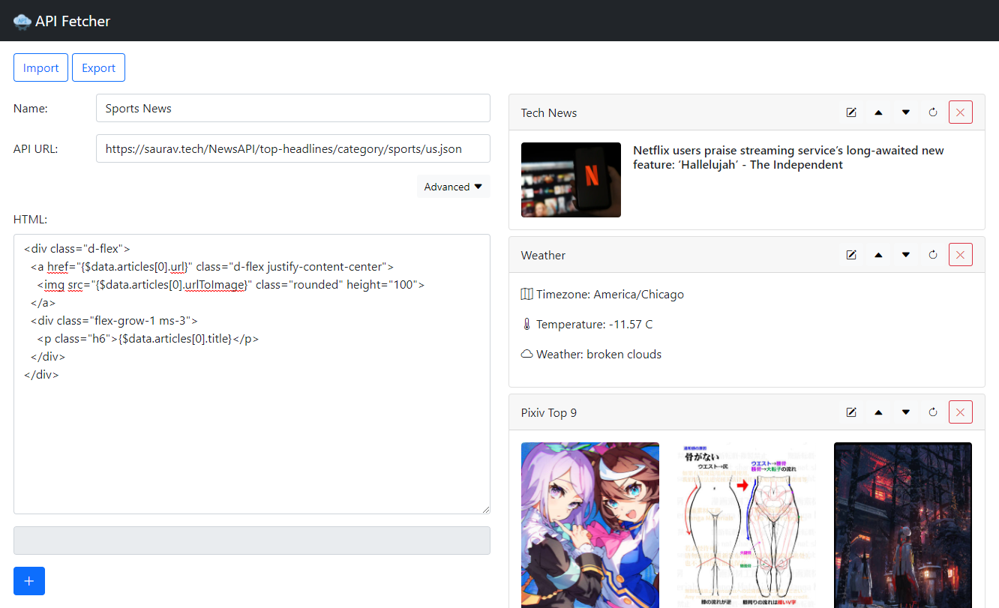
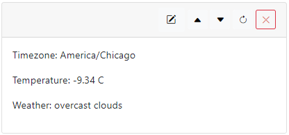
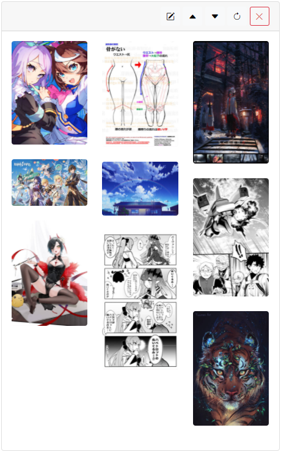
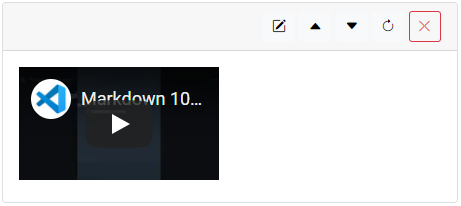

<div id="top"></div>

<!-- PROJECT SHIELDS -->
[![Contributors][contributors-shield]][contributors-url]
[![Forks][forks-shield]][forks-url]
[![Stargazers][stars-shield]][stars-url]
[![Issues][issues-shield]][issues-url]
[![MIT License][license-shield]][license-url]


<!-- PROJECT LOGO -->
<br />
<div align="center">
  
  <h3 align="center">API Fetcher Chrome Extension</h3>

  <p align="center">
    A Chrome extension to fetch APIs in popup widget
    <br />
    <a href="https://github.com/SteinsFu/api-fetcher-chrome-extension/issues">Report Bug</a>
    ·
    <a href="https://github.com/SteinsFu/api-fetcher-chrome-extension/issues">Request Feature</a>
  </p>
</div>


<!-- TABLE OF CONTENTS -->
<details>
  <summary>Table of Contents</summary>
  <ol>
    <li>
      <a href="#about-the-project">About The Project</a>
      <ul>
        <li><a href="#3rd-party-libraries">3rd-Party Libraries</a></li>
      </ul>
    </li>
    <li>
      <a href="#getting-started">Getting Started</a>
      <ul>
        <li><a href="#installation">Installation</a></li>
      </ul>
    </li>
    <li>
      <a href="#usage">Usage</a>
      <ul>
        <li><a href="#bootstrap-5-css-and-icons">Bootstrap 5 CSS and Icons</a>
        <li><a href="#how-to-add-an-api-card">How to add an API Card</a>
        <li><a href="#statement-evaluation">Statement Evaluation</a>
        <ul>
          <li><a href="#evaluation-limitations">Evaluation Limitations</a>
        </ul>
        <li><a href="#looping">Looping</a>
        <ul>
          <li><a href="#looping-limitations">Looping Limitations</a>
        </ul>
        <li><a href="#examples">Examples</a>
      </ul>
    </li>
    <li><a href="#roadmap">Roadmap</a></li>
    <li><a href="#contributing">Contributing</a></li>
    <li><a href="#license">License</a></li>
    <li><a href="#acknowledgments">Acknowledgments</a></li>
  </ol>
</details>


<!-- ABOUT THE PROJECT -->
## About The Project

This is a Chrome extension for users to customize widgets to fetch APIs and show the results in a customized way in the extension popup window.

<div align="center"></div>

<p align="right">(<a href="#top">back to top</a>)</p>


### 3rd-Party Libraries

Download Links:
* [JQuery 3.6.0](https://code.jquery.com/jquery-3.6.0.min.js)
* [Bootstrap 5.1.3](https://github.com/twbs/bootstrap/releases/download/v5.1.3/bootstrap-5.1.3-dist.zip)
* [Bootstrap Icons 1.8.0](https://github.com/twbs/icons/releases/tag/v1.8.0)

<p align="right">(<a href="#top">back to top</a>)</p>


<!-- GETTING STARTED -->
## Getting Started

### Installation
1. Clone the repo
   ```sh
   git clone https://github.com/SteinsFu/api-fetcher-chrome-extension.git
   ```
2. Go to [chrome://extensions](chrome://extensions) and turn on **Developer mode**
3. Click **Load unpacked** and choose the `api-fetcher-chrome-extension` folder

<p align="right">(<a href="#top">back to top</a>)</p>


<!-- USAGE EXAMPLES -->
## Usage

### Bootstrap 5 CSS and Icons
We are using Bootstrap 5 css and icons. you can insert html with Bootstrap 5 css.
- Bootstrap doc: https://getbootstrap.com/docs/5.1/getting-started/introduction/
- Bootstrap icons: https://icons.getbootstrap.com/

### How to add an API Card
1. Click the extension icon
2. Click the edit button on the top-left corner of the popup to go to the **main edit page**.
3. Input the API url and input your prefered HTML code for displaying the results of the API fetch.
4. Click the _blue_ + button.

<div align="center"></div>
<p align="center">main edit page</p>
</br>

### Statement Evaluation
- Use `{}` to evaluate the statement
- Use `$data` to access the response data
- Use `<var-name>=<value>;` to declare variable (card scoped) before your evalution statement (**Remember to put `;` at the end of each variable declaration**)
- Use `$vars.<var-name>` to access your variable
- e.g.
  - response:
  ```json
  {
    "contents": [
      {
        "info": {"title": "Hello World"}
      }
    ]
  }
  ```
  - You can write your html code and access the `title` like this:
  ```html
  <p> Title: {x=5;y=add($vars.x, 2);i=randomInt($data.contents.length);$data.contents[$var.i].info.title} </p>
  <p> Variable x: {$vars.x} (Expected: 5) </p>
  <p> Variable y: {$vars.y} (Expected: 7) </p>
  ```
- Unless it is wrapped by function, value of a variable will be in `string` type by default
  - i.e. Use `{s=Hello World;}` instead of `{s="Hello World";}`}

#### Evaluation Limitations
- Do not support javascript operators such as `+` `-` `*` `/` `%` `&&` `||` etc.
- Only the following functions can be used inside `{}` for now:

  | Function    | Return      |
  | ----------- | ----------- |
  | `add(a, b, c, ...)` | `a + b + c + ...` |
  | `sub(a, b)` | `a - b` |
  | `mul(a, b, c, ...)` | `a * b * c * ...` |
  | `div(a, b)` | `a / b` |
  | `mod(a, b)` | `a % b` |
  | `int(x)` | cast x to integer |
  | `and(a, b, c, ...)` | `a && b && c && ...` |
  | `or(a, b, c, ...)` | `a \|\| b \|\| c \|\| ...` |
  | `randomInt(max)` | random integer in range [0, max) |
  | `JSONstringify(value, replacer, space)` | `JSON.stringify(value, replacer, space)` |
  | `JSONparse(text, reviver)` | `JSON.parse(text, reviver)` |
  | `timestampToLocale(ts)` | convert unix timestamp to locale date string |

- For Developers/Contributers: If you want to add more functions, please add them into `popup.js` `FNS` constant variable (please follow the [Contributing](#contributing) steps):
  ```javascript
  const FNS = {
    "add": (...args) => args.reduce((acc, cur) => Number(acc) + Number(cur), 0),
    "sub": (a, b) => Number(a) - Number(b),
    "mul": (...args) => args.reduce((acc, cur) => Number(acc) * Number(cur), 1),
    "div": (a, b) => Number(a) / Number(b),
    "mod": (a, b) => Number(a) % Number(b),
    "int": (x) => parseInt(x), 
    "and": (...args) => args.reduce((acc, cur) => Boolean(acc) && Boolean(cur), true),
    "or": (...args) => args.reduce((acc, cur) => Boolean(acc) || Boolean(cur), false),
    "randomInt": (max) => Math.floor(Math.random() * parseInt(max)),
    <== add here...
  }
  ```

### Looping
- Use `<for></for>` tag to create a for loop
  - `<for of="$data.contents">` where `$data.contents` is an array/object
    - if it is an object, each item will be in `[key, value]` (`Array.prototype.entries()`)
  - `<for to="10">`: loop from 0 to 10 (exclusive), step=1
  - `<for from="-5" to="5" step="0.5">`: loop from -5 to 5 (exclusive), step=0.5
- Use `$for.i` to access the current index
- Use `$for.item` to access the current index (`null` if `of` param is not specified)
- e.g.
  - response:
  ```json
  {
    "contents": [
      {
        "info": {
          "title": "Hello World 1",
          "desc": "description 1"
        }
      },
      {
        "info": {
          "title": "Hello World 2",
          "desc": "description 2"
        }
      }
    ]
  }
  ```
  - html (example 1: for...to)
  ```html
  <for to="$data.contents.length">
    <h5>Content {$for.i}:</h5>
    <p>title: {$data.contents[$for.i].info.title}</p>
    <p>desc: {$data.contents[$for.i].info.desc}</p>
  </for>
  ```
  - html (example 2: for...of)
  ```html
  <for of="$data.contents">
    <h5>Content {$for.i}:</h5>
    <p>title: {$for.item.info.title}</p>
    <p>desc: {$for.item.info.desc}</p>
  </for>
  ```
  - html (example 3: nested for)
  ```html
  <for of="$data.contents">
    <h5>Content {$for.i}:</h5>
    <for of="$for.item.info">
      <p>{$for.item[0]}: {$for.item[1]}</p>
    </for>
  </for>
  ```
  <div align="center"></div>
  </br>

#### Looping Limitations
- `<for>` will be parsed before parsing variables and evaluating statement
- Support and do not support the following in `<for>` and `$for`:
  - `$vars.<variable-name>` in for loop arguments (i.e. `of`, `to`, `from`, `step`)
    - ✔️ `<for of="$data.contents"> ... </for>`
    - ✔️ `<for from="0" to="$data.contents.length" step="1"> ... </for>`
    - ❌ `<for to="$vars.i"> ... </for>`
  - only **integer** can be used in array indexing brackets 
    - ✔️ `$for.items[0]`
    - ❌ `$for.items[$var.i]`
    - ❌ `$for.items[$for.i]`
    - ❌ `$for.items[add(1, 2)]`
    - ❌ `$for.items[$for.items[0].idx]`

### Examples
1. Weather API
   - url: https://openweathermap.org/data/2.5/onecall?lat=39.76&lon=-98.5&units=metric&appid=439d4b804bc8187953eb36d2a8c26a02
   - response:
     ```json
     {
       "timezone": ...,
       "current": {
         "temp": ...,
         "weather": [
           {"description": ...}
         ],
         ...
       },
       ...
     }
     ```
   - html:
     ```html
     <p>Timezone: {$data.timezone}</p>
     <p>Temperature: {$data.current.temp} C</p>
     <p>Weather: {$data.current.weather[0].description} </p>
     ```
  <div align="center"></div>
  </br>

2. Weather API with Bootstrap Icons
   - url: https://openweathermap.org/data/2.5/onecall?lat=39.76&lon=-98.5&units=metric&appid=439d4b804bc8187953eb36d2a8c26a02
   - html:
     ```html
     <p>
       <i class="bi bi-map"></i>
       Timezone: {$data.timezone}
     </p>
     <p>
       <i class="bi bi-thermometer-half"></i>
       Temperature: {$data.current.temp} C
     </p>
     <p>
       <i class="bi bi-cloud"></i>
       Weather: {$data.current.weather[0].description} 
     </p>
     ```
   <div align="center"></div>
   </br>

3. Weather API with for loop
   - url: https://openweathermap.org/data/2.5/onecall?lat=39.76&lon=-98.5&units=metric&appid=439d4b804bc8187953eb36d2a8c26a02
   - html:
     ```html
     <div class="row flex-row flex-nowrap" style="max-width: 400px;">
       <for of="$data.daily">
       <div class="col-3 px-1">
         <div class="card card-body px-1 py-0">
           <p class="text-center mb-1">{timestampToLocale($for.item.dt)}</p> 
           <p class="mb-1"><i class="bi bi-thermometer-high"></i> {$for.item.temp.max}°C
           <p class="mb-1"><i class="bi bi-thermometer-low"></i> {$for.item.temp.min}°C</p>
         </div>
       </div>
       </for>
     </div>
     ```
   <div align="center"></div>
   </br>

4. Pixiv Illustration API #1
   - url: https://www.pixiv.net/ranking.php?format=json&content=illust
   - response:
     ```json
     {
       "contents": [
         {"illust_id": ...},
         ...
       ]
     }
     ```
   - html (example 1: get the **first result** in contents):
     ```html
     
     ```
   - html (example 2: get a **random result** in contents):
     ```html
     
   <div align="center"></div>
   </br>


5. Pixv Illustraion API #2
   - url: https://www.pixiv.net/ranking.php?format=json&content=illust
   - html (example 1: get the **first 9 results**):
   ```html
   <div class="row">
     <div class="col-4 mb-4 mb-lg-0">
       
       
       
     </div>
     <div class="col-4 mb-4 mb-lg-0">
       
       
       
     </div>
     <div class="col-4 mb-4 mb-lg-0">
       
       
       
     </div>
   </div>
   ```
   - html (example 2: declare **9 random integers** as **variables** for each and get random results):
   ```html
   {pixivUrl=https://www.pixiv.net/artworks;pixivProxy=https://pximg.rainchan.win/img;}
   <div class="row">
     <div class="col-4 mb-4 mb-lg-0">
       <a href="{$vars.pixivUrl}/{i=randomInt($data.contents.length);$data.contents[$vars.i].illust_id}" target="_blank">
         
       </a>
       <a href="{$vars.pixivUrl}/{i=randomInt($data.contents.length);$data.contents[$vars.i].illust_id}" target="_blank">
         
       </a>
       <a href="{$vars.pixivUrl}/{i=randomInt($data.contents.length);$data.contents[$vars.i].illust_id}" target="_blank">
         
       </a>
     </div>
     <div class="col-4 mb-4 mb-lg-0">
       <a href="{$vars.pixivUrl}/{i=randomInt($data.contents.length);$data.contents[$vars.i].illust_id}" target="_blank">
         
       </a>
       <a href="{$vars.pixivUrl}/{i=randomInt($data.contents.length);$data.contents[$vars.i].illust_id}" target="_blank">
         
       </a>
       <a href="{$vars.pixivUrl}/{i=randomInt($data.contents.length);$data.contents[$vars.i].illust_id}" target="_blank">
         
       </a>
     </div>
     <div class="col-4 mb-4 mb-lg-0">
       <a href="{$vars.pixivUrl}/{i=randomInt($data.contents.length);$data.contents[$vars.i].illust_id}" target="_blank">
         
       </a>
       <a href="{$vars.pixivUrl}/{i=randomInt($data.contents.length);$data.contents[$vars.i].illust_id}" target="_blank">
         
       </a>
       <a href="{$vars.pixivUrl}/{i=randomInt($data.contents.length);$data.contents[$vars.i].illust_id}" target="_blank">
         
       </a>
     </div>
   </div>
   ```
   - html (example 3: use nested `<for>` (for loop) to display **9 random results**:
   ```html
   {pixivUrl=https://www.pixiv.net/artworks;pixivProxy=https://pximg.rainchan.win/img;}
   <div class="row">
     <for to="3">
     <div class="col-4 mb-4 mb-lg-0">
       <for to="3">
       <a href="{$vars.pixivUrl}/{i=randomInt($data.contents.length);$data.contents[$vars.i].illust_id}" target="_blank">
         
       </a>
       </for>
     </div>
     </for>
   </div>
   ```
   - html (example 4: use nested `<for>` (for loop) to display **first 9 results**:
   ```html
   {pixivUrl=https://www.pixiv.net/artworks;pixivProxy=https://pximg.rainchan.win/img;}
   <div class="row">
     <for to="3">
     {outer_i=$for.i;}
     <div class="col-4 mb-4 mb-lg-0">
       <for to="3">
       {inner_i=$for.i; idx=add(mul(3, $vars.outer_i), $vars.inner_i);}
       <a href="{$vars.pixivUrl}/{$data.contents[$vars.idx].illust_id}" target="_blank">
         
       </a>
       </for>
     </div>
     </for>
   </div>
   ```
   <div align="center"></div>
   </br>

6. News API
   - url: https://saurav.tech/NewsAPI/top-headlines/category/technology/us.json
   - response:
   ```json
   {
     "articles": [
       {
         "author": ...,
         "title": ...,
         "url": ...,
         "urlToImage": ...,
         ...
       },
       ...
     ]
   }
   ```
   - html (example 1: just get the **first** article):
   ```html
   <div class="d-flex">
     <a href="{$data.articles[0].url}" class="d-flex justify-content-center" target="_blank">
       
     </a>
     <div class="flex-grow-1 ms-3">
       <p class="h6">{$data.articles[0].title}</p>
     </div>
   </div>
   ```
   - html (example 2: declare a **random integer** as **variable** and get a random article):
   ```html
   <div class="d-flex">
     <a href="{i=randomInt($data.articles.length);$data.articles[$vars.i].url}" class="d-flex justify-content-center" target="_blank">
       
     </a>
     <div class="flex-grow-1 ms-3">
       <p class="h6">{$data.articles[$vars.i].title}</p>
     </div>
   </div>
   ```
   - html (example 3: declare the variables at the top):
   ```html
   {i=randomInt($data.articles.length);}
   <div class="d-flex">
     <a href="{$data.articles[$vars.i].url}" class="d-flex justify-content-center" target="_blank">
       
     </a>
     <div class="flex-grow-1 ms-3">
       <p class="h6">{$data.articles[$vars.i].title}</p>
     </div>
   </div>
   ```
   - html (example 4: declare an object as a variable):
   ```html
   {i=randomInt($data.articles.length);article=$data.articles[$vars.i];}
   <div class="d-flex">
     <a href="{$vars.article.url}" class="d-flex justify-content-center" target="_blank">
       
     </a>
     <div class="flex-grow-1 ms-3">
       <p class="h6">{$vars.article.title}</p>
     </div>
   </div>
   ```
   <div align="center"></div>
   </br>

7. Noembed.com Youtube Video
   - url: https://noembed.com/embed?url=https://www.youtube.com/watch?v=3wmqu4LzuoU
   - response:
   ```json
   {
     "author_name": ...,
     "author_url": ...,
     "html": "<iframe ...></iframe>",
     ...
   }
   ```
   - html:
   ```html
   {$data.html}
   ```
   <div align="center"></div>
   </br>
> Warning: using iframe might make the popup slow


<p align="right">(<a href="#top">back to top</a>)</p>


<!-- ROADMAP -->
## Roadmap
- [x] Allow accessing fetched object using `{obj-path}` in HTML
- [x] Add advanced options for fetching URLs
- [x] Add Extension Icon
- [x] Allow Ordering
- [x] Add Export & Import cards function
- [x] Allow simple JS injection without using eval
- [x] Allow declaring variables for each card
- [x] Allow looping templates in html
- [ ] Multiple APIs fetching in one card
- [ ] Extend statement evalutaion function pools to all functions in `window` object
- [ ] Allow injecting "Referer" to request headers
- [ ] Add template URLs and HTMLs

See the [open issues](https://github.com/SteinsFu/api-fetcher-chrome-extension/issues) for a full list of proposed features (and known issues).

<p align="right">(<a href="#top">back to top</a>)</p>


<!-- CONTRIBUTING -->
## Contributing

Contributions are what make the open source community such an amazing place to learn, inspire, and create. Any contributions you make are **greatly appreciated**.

If you have a suggestion that would make this better, please fork the repo and create a pull request. Please create a new branch and do not work on master branch directly.

1. Fork the Project
2. Create your Feature Branch (`git checkout -b feature/AmazingFeature`)
3. Commit your Changes (`git commit -m 'Add some AmazingFeature'`)
4. Push to the Branch (`git push origin feature/AmazingFeature`)
5. Open a Pull Request

Since `libs` folder has too many files (especially Bootstrap icons), I suggest developers to do the followings for faster git commit:
```sh
cd libs/bootstrap-icons-1.8.0 
git update-index --assume-unchanged $(git ls-files | tr '\n' ' ')

cd ../bootstrap-5.1.3-dist
git update-index --assume-unchanged $(git ls-files | tr '\n' ' ')

cd ..
git update-index --assume-unchanged jquery-3.6.0.min.js 
```

<p align="right">(<a href="#top">back to top</a>)</p>


<!-- LICENSE -->
## License

Distributed under the MIT License. See `LICENSE` for more information.

<p align="right">(<a href="#top">back to top</a>)</p>


<!-- ACKNOWLEDGMENTS -->
## Acknowledgments
This readme doc is modified from:
* [Best-README-Template](https://github.com/othneildrew/Best-README-Template)

<p align="right">(<a href="#top">back to top</a>)</p>


<!-- MARKDOWN LINKS & IMAGES -->
<!-- https://www.markdownguide.org/basic-syntax/#reference-style-links -->
[contributors-shield]: https://img.shields.io/github/contributors/SteinsFu/api-fetcher-chrome-extension.svg?style=for-the-badge
[contributors-url]: https://github.com/SteinsFu/api-fetcher-chrome-extension/graphs/contributors
[forks-shield]: https://img.shields.io/github/forks/SteinsFu/api-fetcher-chrome-extension.svg?style=for-the-badge
[forks-url]: https://github.com/SteinsFu/api-fetcher-chrome-extension/network/members
[stars-shield]: https://img.shields.io/github/stars/SteinsFu/api-fetcher-chrome-extension.svg?style=for-the-badge
[stars-url]: https://github.com/SteinsFu/api-fetcher-chrome-extension/stargazers
[issues-shield]: https://img.shields.io/github/issues/SteinsFu/api-fetcher-chrome-extension.svg?style=for-the-badge
[issues-url]: https://github.com/SteinsFu/api-fetcher-chrome-extension/issues
[license-shield]: https://img.shields.io/github/license/SteinsFu/api-fetcher-chrome-extension.svg?style=for-the-badge
[license-url]: https://github.com/SteinsFu/api-fetcher-chrome-extension/blob/master/LICENSE.txt
